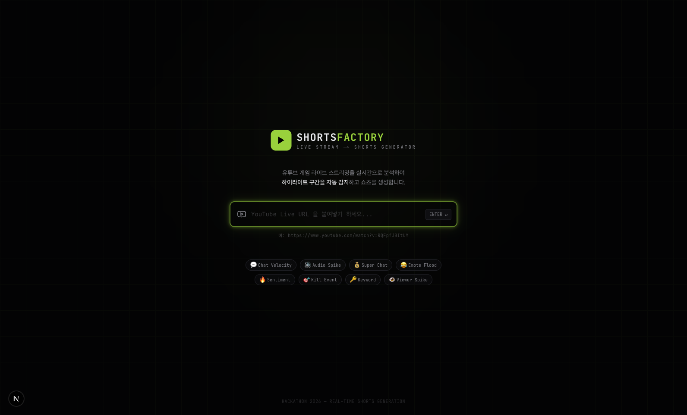

# Shorts Factory — UI/UX Design Specification

## 1. Overview

유튜브 게임 라이브 스트리밍을 실시간으로 모니터링하면서, 주요 인디케이터 기반으로 쇼츠 제작 구간을 자동 추천하고 생성하는 **데스크톱 전용 웹 툴**이다.

- **플랫폼**: Desktop only (min-width: 1280px)
- **스택**: Next.js 16, TypeScript, Tailwind CSS, shadcn/ui, Framer Motion
- **프로토타입**: `localhost:3000` (shorts-factory 프로젝트)

---

## 2. Design Direction

### Aesthetic: **Mission Control / Control Room**

실시간 데이터 모니터링 센터의 느낌. 어두운 배경 위에 네온 컬러로 데이터가 빛나는 HUD 스타일.

### Color Tokens

| Token | Value | Usage |
|-------|-------|-------|
| `--background` | `oklch(0.098 0.005 285)` | 메인 배경 (거의 블랙) |
| `--card` | `oklch(0.135 0.008 285)` | 카드/패널 배경 |
| `--border` | `oklch(0.25 0.012 285)` | 구분선 |
| `--neon-lime` | `oklch(0.795 0.184 128.25)` | 주 액센트 — 활성 상태, CTA, 긍정적 신호 |
| `--neon-cyan` | `oklch(0.777 0.152 199.57)` | 보조 액센트 — 확인된 상태, 링크 |
| `--neon-red` | `oklch(0.637 0.237 15.163)` | 경고/위험 — 오디오 스파이크, 킬 이벤트, REC 표시 |
| `--neon-amber` | `oklch(0.795 0.184 84.429)` | 대기 상태 — 생성 중, 슈퍼챗 |
| `--neon-violet` | `oklch(0.702 0.183 293.54)` | 감정 분석 관련 |
| `--muted-foreground` | `oklch(0.6 0.01 285)` | 비활성 텍스트 |
| `--foreground` | `oklch(0.932 0.005 286)` | 기본 텍스트 |

### Typography

| Usage | Font | Style |
|-------|------|-------|
| 데이터/레이블/시간 | JetBrains Mono | `text-[10px] font-mono uppercase tracking-wider` |
| 제목/본문 | Geist Sans | `text-sm font-medium` |
| 숫자/카운터 | JetBrains Mono | `font-mono tabular-nums` |

### Visual Effects

- **Neon glow**: 활성 인디케이터에 `box-shadow` 기반 글로우 효과
- **Pulse animation**: LIVE 인디케이터, REC 점, 활성 센서에 `animate-neon-pulse`
- **HUD corners**: 스트림 임베드에 코너 브래킷 오버레이
- **Scan line**: 타임라인의 현재 위치 표시선

---

## 3. Screen Flow

```
[Landing Screen] ──Enter URL──► [Main Dashboard]
                                     │
                                     ├── Settings Modal (⚙️ 버튼)
                                     └── Shorts Preview Modal (카드에서 프리뷰)
```

---

## 4. Landing Screen (URL 입력)



### Layout
- 전체 화면 중앙 정렬
- 배경: 다크 + 미세한 그리드 패턴 (`opacity: 0.03`)
- 상단 중앙에 라임 글로우 orb (배경 분위기)

### Components
1. **Logo**: 라임 배경 아이콘 + "SHORTS**FACTORY**" 텍스트
2. **설명 텍스트**: 1줄 한국어 설명, 핵심 키워드 볼드
3. **URL 입력 필드**:
   - 높이: `h-14`, 라운드: `rounded-xl`
   - 왼쪽: YouTube 아이콘
   - 오른쪽: `ENTER ↵` 키 힌트
   - Focus 시: 라임 border + glow 효과
   - Enter로 submit
4. **인디케이터 프리뷰 태그**: 8개 인디케이터를 pill 형태로 나열
5. **Footer**: "HACKATHON 2026" 텍스트

---

## 5. Main Dashboard


### Layout Structure

```
┌──────────────────────────────────────────────────────────────┐
│  HEADER (h-14, fixed)                                         │
├─────────────────────────┬────────────────────────────────────┤
│  LEFT PANEL (40%)       │  RIGHT PANEL (60%)                  │
│                         │                                    │
│  [Stream Embed]         │  [Indicator Timeline]              │
│  16:9 aspect ratio      │  시간축 히트맵 (6 rows)             │
│                         │                                    │
│  [Indicator Dashboard]  │  [Shorts Candidates]               │
│  2x4 grid, 게이지 바    │  스크롤 가능한 카드 리스트           │
│                         │  - pending (라임 border)            │
│  [Manual Capture]       │  - generating (앰버 + progress bar) │
│  HOLD 버튼              │  - confirmed (시안 border)          │
│                         │  - dismissed (회색, 투명)            │
│  [Transcription Feed]   │                                    │
│  실시간 자막 스크롤      │  [Generated Shorts]                 │
│  하이라이트 라인 강조    │  수평 스크롤 카드 (9:16 aspect)     │
└─────────────────────────┴────────────────────────────────────┘
```

### 5.1 Header

높이 `h-14`, 배경 `bg-card`, 하단 border.

| Element | Spec |
|---------|------|
| Logo | 라임 아이콘 (28x28) + "SHORTSFACTORY" (font-mono, bold) |
| Stream URL | 읽기전용 표시, `bg-secondary/60 rounded-md` |
| Connection Status | 녹색 점 + "LIVE" 텍스트 (pulse 애니메이션) |
| REC Timer | 빨간 점 (pulse) + `HH:MM:SS` (tabular-nums) |
| Stats | SHORTS 카운트 (시안) / QUEUE 카운트 (앰버) |
| Settings | 톱니바퀴 아이콘 버튼 |

### 5.2 Left Panel — Stream Embed

- YouTube iframe (`aspect-video`)
- HUD 오버레이: 4개 코너 브래킷 (라임, 50% opacity)
- LIVE 뱃지: 우상단, 빨간 배경 + 흰 텍스트

### 5.3 Left Panel — Indicator Dashboard

- 2열 그리드 (`grid-cols-2 gap-1.5`)
- 각 인디케이터 셀:
  - 이모지 아이콘 + 라벨 + 수치 (0-100)
  - 프로그레스 바 (인디케이터별 고유 색상)
  - 활성 시: `border-border bg-secondary/50`
  - 비활성 시: `opacity-50`
  - 75 이상: 수치 텍스트에 neon-lime + glow

### 5.4 Left Panel — Manual Capture Button

- 전체 폭, `h-12`, 점선 border
- 기본: 회색 텍스트 "HOLD TO CAPTURE"
- 홀드 중: 빨간 border + glow, 프로그레스 채움 애니메이션
- 100% 도달: "CAPTURED!" 텍스트
- 하단: "HOLD FOR 1.5s TO MARK HIGHLIGHT" 안내 텍스트

### 5.5 Left Panel — Transcription Feed

- 헤더: 시안 점 + "LIVE TRANSCRIPTION" + "WHISPER v3"
- ScrollArea 기반 자동 스크롤
- 각 라인: `timestamp + text`
- 하이라이트 라인: `bg-neon-lime/8 border-l-2 border-neon-lime` + 볼드 텍스트
- 일반 라인: `text-muted-foreground`, hover 시 `bg-secondary/40`

### 5.6 Right Panel — Indicator Timeline

- 헤더: 시안 점 + "INDICATOR TIMELINE" + 총 시간
- 시간 마커: 10분 간격, 상단 표시
- 히트맵 행 (6개 인디케이터 타입):
  - 각 행: 라벨(8글자) + 가로 바
  - 이벤트를 컬러 도트로 표시 (opacity = intensity)
  - 인디케이터 타입별 고유 색상
- 현재 위치: 세로선 + 하단 삼각형 + "NOW" 라벨 (라임)

### 5.7 Right Panel — Shorts Candidates

- 헤더: 앰버 점 + "SHORTS CANDIDATES" + pending/generating 카운트
- ScrollArea 기반 스크롤
- 카드별 상태 스타일:

| Status | Border | Background | Label Color |
|--------|--------|------------|-------------|
| `pending` | `neon-lime/30` | `neon-lime/5` | neon-lime |
| `generating` | `neon-amber/30` | `neon-amber/5` | neon-amber |
| `confirmed` | `neon-cyan/30` | `neon-cyan/5` | neon-cyan |
| `dismissed` | `muted/20` | `secondary/20` | muted (+ opacity 40%) |

- 카드 내부:
  - 상태 라벨 + confidence % + 제목
  - 시간 범위 (`start --- end (duration)`)
  - 인디케이터 태그 (각 인디케이터별 컬러 pill)
  - generating: progress bar + "XX% PROCESSING..."
  - pending: CONFIRM (라임 CTA) / DISMISS (ghost) / Preview (outline) 버튼
  - confirmed: PREVIEW 버튼 (시안)
  - 우측: 9:16 썸네일 플레이스홀더

### 5.8 Right Panel — Generated Shorts

- 수평 스크롤 (`flex gap-3 overflow-x-auto`)
- 각 카드: `w-28`, `aspect-[9/14]`
- 그라데이션 배경 + 중앙 재생 아이콘 (라임)
- 하단 오버레이: 제목 (2줄 clamp)
- 메타: 생성 시간 + DL 링크 (시안)
- hover: `border-neon-lime/40` 전환

---

## 6. Modals

### 6.1 Shorts Preview Modal

- `max-w-2xl`, 2분할 레이아웃
- **좌측**: 블랙 배경 + 9:16 폰 프레임 목업 (재생 아이콘, 제목, 채널명)
- **우측** (w-64):
  - Trim Range: 듀얼 슬라이더 + 시작/종료 시간
  - Caption: textarea (기본값: 자동 생성 캡션)
  - Detected Indicators: 태그 뱃지
  - Export Format: MP4 (기본 선택) / WEBM 토글
  - GENERATE SHORT: 라임 CTA 버튼
  - CANCEL: ghost 버튼

### 6.2 Settings Modal

- `max-w-md`
- YouTube API Key: password input
- Indicator Sensitivity: 인디케이터별 슬라이더 (0-100)
- Shorts Duration: 15s / 30s / 45s / 60s 토글 (기본: 30s)
- Auto-confirm Threshold: 슬라이더 (50-100%, 기본: 85%)

---

## 7. Component Inventory

| Component | Path | Description |
|-----------|------|-------------|
| `LandingScreen` | `components/landing/` | URL 입력 랜딩 화면 |
| `Header` | `components/layout/` | 상단 헤더 바 |
| `LeftPanel` | `components/layout/` | 왼쪽 패널 컨테이너 |
| `RightPanel` | `components/layout/` | 오른쪽 패널 컨테이너 |
| `StreamEmbed` | `components/stream/` | YouTube iframe + HUD 오버레이 |
| `TranscriptionFeed` | `components/stream/` | 실시간 자막 피드 |
| `IndicatorDashboard` | `components/indicators/` | 인디케이터 게이지 그리드 |
| `IndicatorTimeline` | `components/indicators/` | 시간축 히트맵 |
| `ManualCaptureButton` | `components/indicators/` | HOLD 캡처 버튼 |
| `ShortsCandidateCard` | `components/shorts/` | 추천 구간 카드 |
| `GeneratedShortsGrid` | `components/shorts/` | 생성된 쇼츠 가로 스크롤 |
| `ShortsPreviewModal` | `components/shorts/` | 쇼츠 미리보기/편집 모달 |
| `SettingsModal` | `components/modals/` | 설정 모달 |

---

## 8. Interaction Patterns

### Manual Capture
1. 버튼 `mousedown` → 홀드 시작, 프로그레스 채움 (1.5초간 0→100%)
2. 100% 도달 → "CAPTURED!" 표시 + 해당 시점 하이라이트 마킹
3. `mouseup` 또는 `mouseleave` → 리셋

### Shorts Candidate Flow
1. 인디케이터 조합이 threshold 초과 → 새 candidate 카드 생성 (`pending`)
2. 사용자 CONFIRM → `confirmed` 상태 전환
3. Auto-confirm (confidence ≥ 85%) → 자동 `confirmed`
4. `confirmed` → 백그라운드 쇼츠 생성 시작 (`generating` + progress bar)
5. 생성 완료 → Generated Shorts 그리드에 추가 (`done`)
6. DISMISS → 카드 흐려짐 (`opacity: 40%`)

### Transcription Highlight
- 인디케이터 활성화 시점의 전사 라인 자동 하이라이트
- 하이라이트 라인: 라임 좌측 border + 볼드 텍스트 + 연한 라임 배경

---

## 9. Responsive Behavior

데스크톱 전용. `min-width: 1280px` 이하에서는 지원하지 않음.
- Left panel: `w-[40%] min-w-[480px]`
- Right panel: `flex-1 min-w-[640px]`
- Body: `overflow-hidden` (전체 페이지 스크롤 없음, 각 섹션 내부 스크롤)
