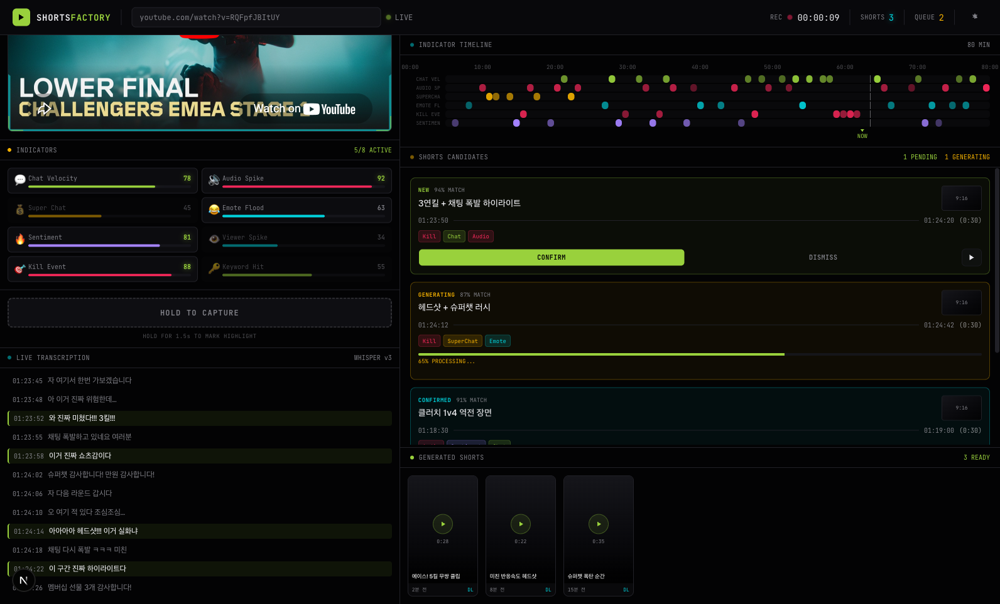

# LiveO — Valorant Live Streaming Highlight Extractor

Valorant 라이브 스트리밍 중 하이라이트 구간을 실시간으로 감지하고, 숏폼 콘텐츠(TikTok, YouTube Shorts, Instagram Reels)용 9:16 vertical video로 자동 추출하는 시스템.




## Quick Start

### Prerequisites

- Python >= 3.10
- Node.js >= 18
- ffmpeg >= 6.0
- yt-dlp >= 2024.01.01 (demo mode)

### Backend

```bash
# 프로젝트 루트에서
pip install -e ".[dev]"

# API 서버 실행
python -m backend --serve
# → http://localhost:8000

# 또는 CLI 모드 (스트림 캡처만)
python -m backend --mode demo --url "https://www.youtube.com/watch?v=VIDEO_ID"
```

### Frontend

```bash
cd frontend
npm install
npm run dev
# → http://localhost:3000
```

## Architecture

```
┌──────────────────────────────────────────────────────┐
│                  Frontend (Next.js)                   │
│         http://localhost:3000                         │
│                                                      │
│  LandingScreen → Main Dashboard                      │
│  ├── StreamEmbed (YouTube iframe)                    │
│  ├── IndicatorDashboard (13 real-time indicators)    │
│  ├── TranscriptionFeed (live STT)                    │
│  ├── ManualCaptureButton (hold-to-capture)           │
│  ├── ShortsCandidateCard (highlight candidates)      │
│  ├── ShortsPreviewModal (crop/letterbox/cam_split)   │
│  └── SettingsModal (sensitivity, duration, API key)  │
│                                                      │
│  lib/api.ts ──── REST fetch + WebSocket client       │
│  lib/use-liveo.ts ── React hook (state + WS events)  │
└───────────────┬──────────────────────────────────────┘
                │ HTTP + WebSocket
                ▼
┌──────────────────────────────────────────────────────┐
│               Backend (FastAPI + Python)              │
│         http://localhost:8000                         │
│                                                      │
│  server.py ───── REST API + WebSocket /ws/events     │
│  ws_manager.py ─ Connection manager + broadcast      │
│  models.py ───── Pydantic models (camelCase alias)   │
│  pipeline.py ─── Capture → Segmentation orchestrator │
│  capture.py ──── RTMP / yt-dlp stream capture        │
│  ring_buffer.py ─ 5min circular segment buffer       │
│  events.py ───── Event types (12 kinds)              │
└──────────────────────────────────────────────────────┘
```

## API Endpoints

### Stream Control

| Method | Path | Description |
|--------|------|-------------|
| POST | `/api/stream/start` | 스트림 캡처 시작 (`{ source: "obs"\|"demo", url }`) |
| POST | `/api/stream/stop` | 스트림 캡처 중단 |
| GET | `/api/stream/status` | 스트림 상태 조회 |

### Shorts Candidates

| Method | Path | Description |
|--------|------|-------------|
| GET | `/api/shorts/candidates` | 후보 목록 조회 |
| POST | `/api/shorts/candidates` | 후보 생성 (manual capture) |
| PATCH | `/api/shorts/candidates/{id}` | 상태 변경 (confirmed/dismissed) |
| DELETE | `/api/shorts/candidates/{id}` | 후보 삭제 |

### Shorts Generation

| Method | Path | Description |
|--------|------|-------------|
| POST | `/api/shorts/generate` | 클립 생성 요청 (template, crop, trim) |
| GET | `/api/shorts` | 생성된 쇼츠 목록 |

### Settings

| Method | Path | Description |
|--------|------|-------------|
| GET | `/api/settings` | 설정 조회 |
| PATCH | `/api/settings` | 설정 변경 |

### WebSocket

| Path | Description |
|------|-------------|
| `ws://localhost:8000/ws/events` | 실시간 이벤트 push |

**WebSocket Event Types:**
- `stream_status` — 스트림 상태 변경
- `segment_ready` — 새 비디오 세그먼트
- `candidate_created` / `candidate_updated` / `candidate_deleted` — 후보 lifecycle
- `generate_progress` / `generate_complete` — 클립 생성 진행률

## Project Structure

```
LiveO/
├── backend/
│   ├── __main__.py       # CLI + serve 엔트리포인트
│   ├── server.py         # FastAPI REST + WebSocket
│   ├── models.py         # Pydantic 모델 (Frontend types.ts 매칭)
│   ├── ws_manager.py     # WebSocket 연결 관리
│   ├── pipeline.py       # 캡처 → 세그먼트 파이프라인
│   ├── capture.py        # RTMP / yt-dlp 캡처
│   ├── ring_buffer.py    # 순환 세그먼트 버퍼 (5분)
│   ├── events.py         # 이벤트 타입 정의 (12종)
│   └── docs/             # 모듈별 설계 문서
├── frontend/
│   ├── app/              # Next.js App Router
│   ├── components/       # UI 컴포넌트
│   │   ├── indicators/   # 인디케이터 대시보드, 타임라인
│   │   ├── shorts/       # 후보 카드, 프리뷰 모달, 생성 그리드
│   │   ├── stream/       # 스트림 임베드, 트랜스크립션
│   │   ├── layout/       # Header, LeftPanel, RightPanel
│   │   ├── modals/       # 설정 모달
│   │   └── ui/           # shadcn/ui 기반 공통 컴포넌트
│   └── lib/
│       ├── api.ts        # REST + WebSocket 클라이언트
│       ├── use-liveo.ts  # React hook (상태 + WS 이벤트)
│       ├── types.ts      # TypeScript 타입 정의
│       └── mock-data.ts  # 개발용 mock 데이터
├── tests/                # pytest 테스트 (55건)
├── docs/
│   ├── PRD.md            # 제품 요구사항 문서
│   └── screenshots/      # UI 스크린샷
└── pyproject.toml        # Python 프로젝트 설정
```

## Highlight Detection (Multi-Signal)

| Signal | Weight | Method |
|--------|--------|--------|
| Kill Feed OCR | 0.4 | Valorant 킬피드 영역 (우상단) OCR |
| Audio Excitement | 0.3 | 음량 급증 + 피치 변화 감지 |
| Keyword Matching | 0.3 | STT transcript에서 감탄사/게임용어 탐지 |

**Score >= 0.6 → 하이라이트 후보 생성**

## Video Editing Templates

### Template A — Overlay Layout
- 게임 화면 9:16 전체
- 하단: 스트리머 웹캠 고정
- 상단: 킬 로그 오버레이 (optional)

### Template B — Dynamic Layout
- 게임 화면 9:16 전체 (방해 최소화)
- 스트리머 얼굴: 발화 시에만 2~3초 팝업
- 킬 로그: 킬 발생 시에만 2~3초 팝업

### Combat Effects
- Zoom 1.2~1.5x (킬 시점 전후)
- Slow-Motion 0.5~0.7x (킬 시점 전후)

## Output Specifications

| Item | Value |
|------|-------|
| Duration | 15s ~ 30s |
| Aspect Ratio | 9:16 (vertical) |
| Resolution | 1080x1920 |
| Codec | H.264 (video), AAC (audio) |
| Format | .mp4 |

## Tests

```bash
# 전체 테스트 실행
python -m pytest tests/ -v

# 서버 테스트만
python -m pytest tests/test_server.py -v
```

## Tech Stack

| Layer | Technology |
|-------|-----------|
| Frontend | Next.js 16, React 19, TypeScript, Tailwind CSS 4 |
| Backend | Python 3.10+, FastAPI, Pydantic v2 |
| Realtime | WebSocket |
| Stream Capture | OBS RTMP (prod) / yt-dlp (demo) |
| Video Processing | ffmpeg |
| Audio | Silero VAD, Deepgram Nova-3 (prod) / faster-whisper (dev) |
| OCR | EasyOCR / Tesseract |

## Team

| Member | Role |
|--------|------|
| Jemin | Web UI + Frontend |
| Seongheum | Live Stream Capture + Pipeline |
| Sungman | Transcription + Highlight Detection + Editing |
